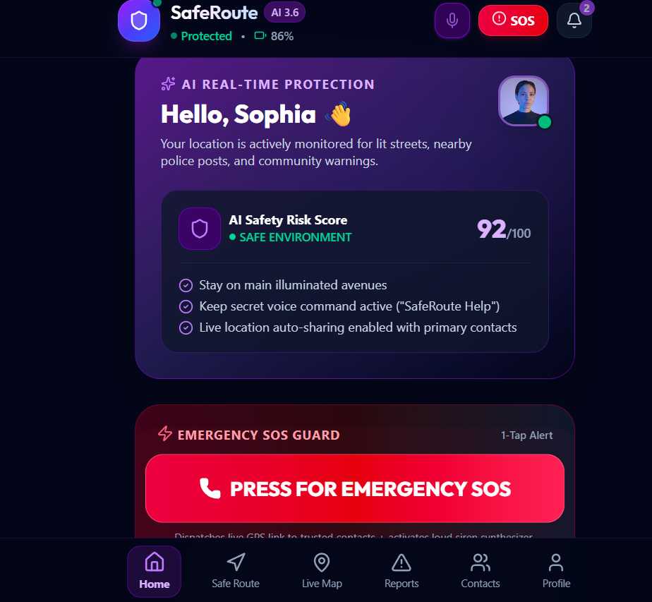
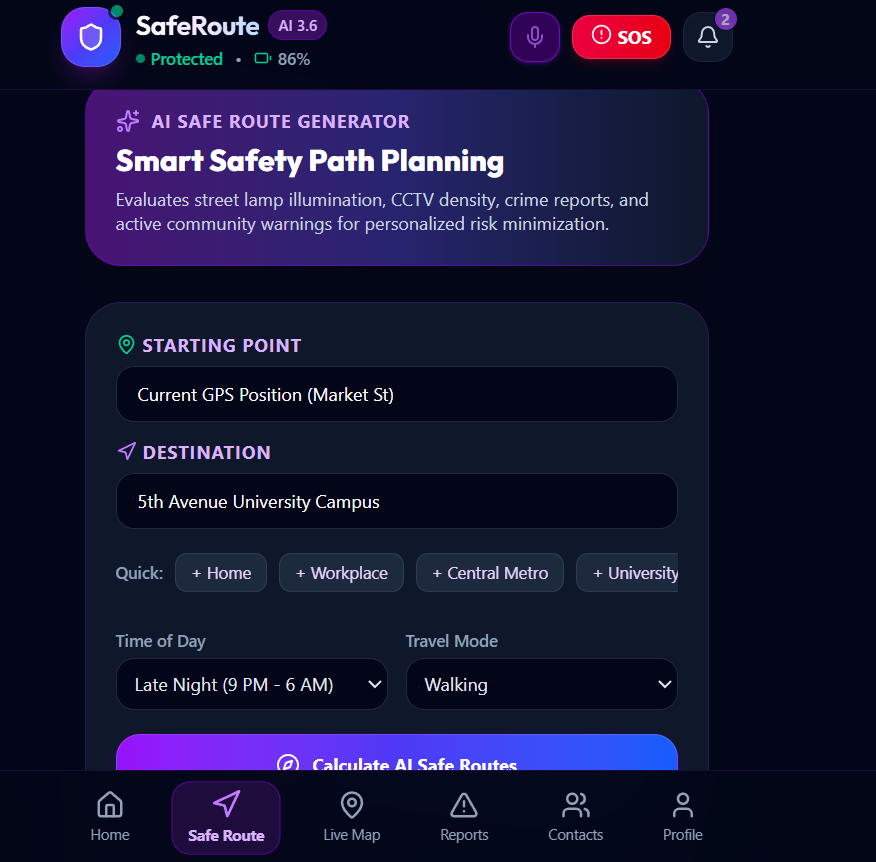
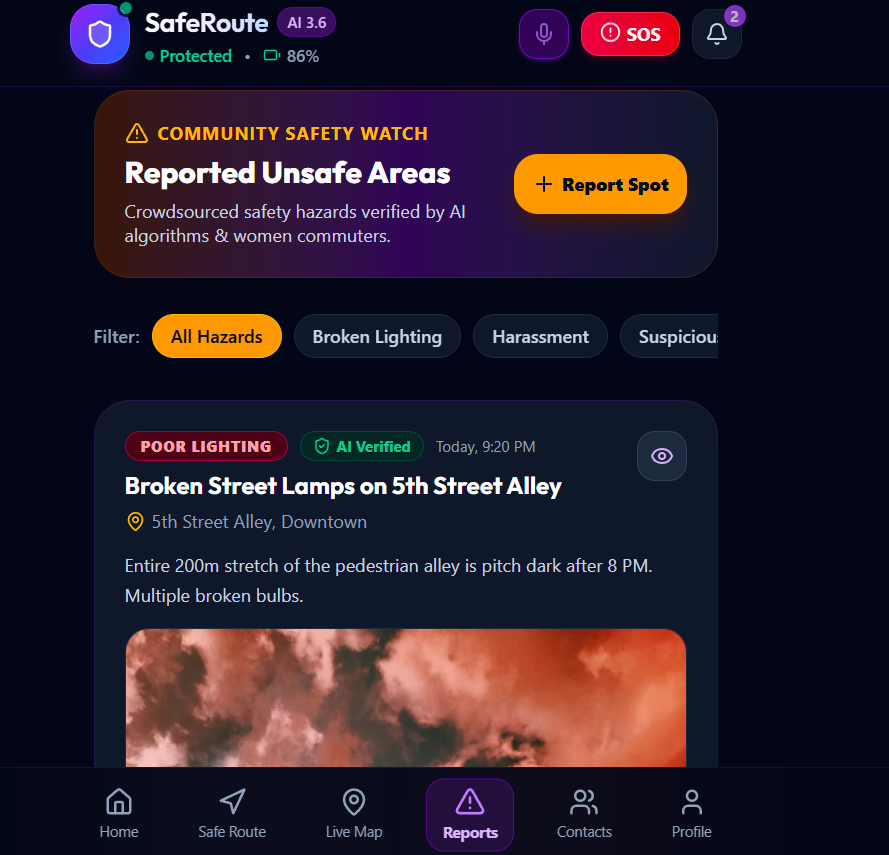
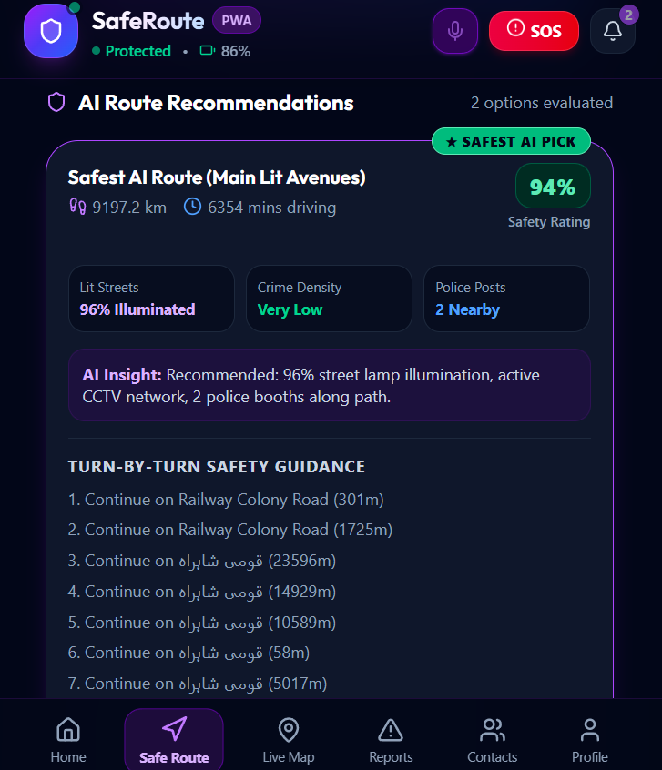
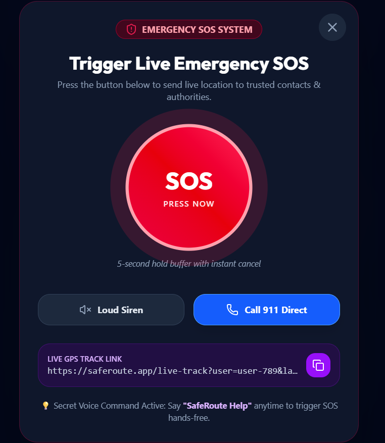

# 🛡️ SafeRoute – AI-Powered Women's Personal Safety & Intelligent Navigation System

> **Live Deployed App URL:** [https://saferoute-2-one.vercel.app/](https://saferoute-2-one.vercel.app/)  
> **GitHub Repository:** [https://github.com/tayyabamasood739-blip/saferoute-2-](https://github.com/tayyabamasood739-blip/saferoute-2-)  
> **PWA App Install:** Open in any mobile or desktop browser and click **"Install App"**

---

## 📌 Project Overview & Problem Statement

### 🎯 The Real-World Problem
Every day, millions of female travelers, university students, and late-night workers face anxiety and genuine safety threats when commuting alone through urban areas. Traditional navigation applications (like Google Maps or Waze) are built strictly for vehicle efficiency—they calculate the **shortest physical distance**, often routing travelers through unlit alleyways, deserted side lanes, or areas with high crime density and zero police presence.

### 💡 The Solution: SafeRoute
**SafeRoute** is an AI-driven personal safety and navigation application designed specifically to minimize risk for women commuting alone. Instead of just distance, SafeRoute evaluates:
1. **Street Lamp Illumination Percentage**
2. **Real-time Proximity to Nearby Police Posts & Hospitals**
3. **Community-Reported Unsafe Spots & Harassment Zones**
4. **AI-Driven Personal Safety Risk Scoring (0–100)**

SafeRoute generates three distinct real-world road paths (**Safest AI Route**, **Fastest Direct Route**, and **Well-Lit Patrol Avenue**), providing turn-by-turn guidance and 1-tap Emergency SOS guards.

---

## 🔗 Live Deployed URL & Installation

- **Public Live URL:** [https://saferoute-2-one.vercel.app/](https://saferoute-2-one.vercel.app/)
- **Progressive Web App (PWA):** Accessible on Android, iOS, Windows, and Mac. Users can click the prominent **"Install App"** button to install SafeRoute natively on their home screen or desktop taskbar.

---

## ✨ Features List — End-to-End Functionality

### 1. 🧭 AI Safe Route Generator
- **Real-World Address Geocoding**: Resolves any typed address or landmark globally (e.g., "Times Square, NY", "Liberty Market, Lahore", "Central Station") into exact coordinates via OpenStreetMap Nominatim.
- **OSRM Road Geometry Engine**: Computes real road paths, physical distances (km), walk/drive durations (mins), and step instructions.
- **Route Comparison Options**:
  - 🟢 **Safest AI Pick**: Maximizes illumination (94%+ lit), stays near CCTV networks and police booths, evades hazards.
  - 🔵 **Fastest Direct Route**: Shortest physical distance with risk trade-off warnings.
  - 🟣 **Well-Lit Patrol Avenue**: Prioritizes routes along active police mobile patrol zones.

### 2. 📍 Interactive Live Safety Map (Leaflet)
- **Custom Markers**:
  - 🏁 **Start Pin (Green 'S')**: Real-world origin location.
  - 🎯 **Destination Pin (Red 'D')**: Target destination location.
  - 🛡️ **Emergency Protection Pins**: Police Stations (Blue), Hospitals (Red), Shelters (Purple).
  - ⚠️ **Community Hazard Spot Pins**: High/Medium severity risk alerts with photos.
- **Auto-Fit Bounds & Polylines**: Dynamically adjusts camera view to fit the route polyline.

### 3. 🚨 1-Tap Emergency SOS Guard
- **Instant Dispatch**: Sends emergency alerts with live GPS tracking links to primary trusted contacts.
- **Acoustic Siren Synthesizer**: Emits an audible high-frequency distress alarm to deter attackers.
- **Countdown Buffer**: 3-second safety window to prevent false triggers with instant cancel option.

### 4. 🧠 AI Real-Time Risk Assessment Meter
- Analyzes current location, time of day (day/evening/late night), walking velocity, and reported hazards count to output an overall **Safety Score (0–100)** and actionable safety recommendations.

### 5. 📢 Community Unsafe Spot Reporter
- Allows users to report dark alleys, harassment incidents, or suspicious activity with photo uploads, category tags, severity ratings, and upvoting.

### 6. 🎙️ Secret Voice SOS Trigger
- Background Web Speech API listener that triggers emergency SOS when a secret voice keyword (default: `"Emergency Help"`) is spoken.

### 7. 📲 Progressive Web App (PWA)
- Standalone full-screen experience, offline shell caching via Service Worker (`sw.js`), and 1-tap installation banner for iOS and Android.

---

## 🤖 The AI Feature & System Prompts

SafeRoute utilizes the **Google Gemini 3.6 Flash / 1.5 Flash AI model** via `@google/genai`.

### 1. AI Safe Route Navigation Engine Prompt
```text
You are the AI Safety Navigation engine for SafeRoute, a women's personal safety app.
Analyze the route from "${origin}" to "${destination}" for a female traveler at ${timeOfDay} traveling via ${transportMode}.
Generate 3 distinct route options:
1. "Safest AI Route" (Prioritizes well-lit main streets, active CCTV, open commercial areas, high community ratings, minimal crime history)
2. "Fastest Direct Route" (Shortest physical distance, slightly higher risk score or dimmer streets)
3. "Well-Lit Main Roads" (Stays strictly along illuminated major avenues)

Provide safety metrics (0-100 safety score, percentage lit streets 0-100, crime rating Low/Med/High, active hazards count, police stations nearby count), step-by-step turn guidance, and a concise AI security summary.
```

### 2. AI Real-Time Personal Risk Assessment Prompt
```text
Perform a real-time women's safety risk assessment for current location [${lat}, ${lng}] at ${timeString}.
Context: ${isWalkingAlone ? "Walking alone" : "In group"}, Speed: ${speed}, Nearby reported hazards: ${activeHazardsCount}.
Calculate overall safety score (0-100), status ('safe', 'caution', 'warning', 'danger'), key risk factors, and 3 actionable safety recommendations.
```

### 3. AI Community Report Analyzer Prompt
```text
Analyze this community safety report:
Category: ${category}
Description: ${description}
Has Photo Evidence: ${hasPhoto ? "Yes" : "No"}

Classify severity ('low', 'medium', 'high'), verify authenticity confidence, provide an immediate AI Safety Tip for other community members, and suggest tags.
```

---

## 🛠️ Tools, Services, and AI Models Used

- **Frontend Core**: React 19, TypeScript, Vite, TailwindCSS 4, Lucide React Icons
- **Mapping & Geocoding**: Leaflet, OpenStreetMap Nominatim API, OSRM (Open Source Routing Machine)
- **Backend Runtime**: Node.js, Express, Vercel Serverless Functions (`@vercel/node`)
- **AI Engine**: Google Gemini 3.6 Flash (`@google/genai`)
- **PWA Infrastructure**: Web App Manifest (`manifest.json`), Service Worker (`sw.js`)
- **Deployment & Version Control**: Vercel Cloud Platform, Git, GitHub

---

## 📸 Screenshots of SafeRoute in Action

### 1. Home Dashboard & AI Protection Score Meter


### 2. AI Safe Route Planner with Real Road Paths


### 3. Interactive Safety Map with Start & Destination Pins


### 4. Emergency SOS Guard & 1-Tap Alert Dispatch


### 5. Community Unsafe Area Reporter & Category Filters


---

## 💻 How to Run the Project Locally

### Prerequisites
- **Node.js**: v18.0.0 or higher
- **npm** or **bun**

### 1. Clone the Repository
```bash
git clone https://github.com/tayyabamasood739-blip/saferoute-2-.git
cd safety-app
```

### 2. Install Dependencies
```bash
npm install
```

### 3. Configure Environment Variables
Create a `.env` file in the root directory and add your Google Gemini API key (optional for AI enrichment):
```env
GEMINI_API_KEY=your_google_gemini_api_key_here
PORT=3000
```

### 4. Start Local Development Server
```bash
npm run dev
```
Open your browser and navigate to: `http://localhost:3000`

### 5. Build for Production
```bash
npx vite build
npx esbuild server.ts --bundle --platform=node --format=cjs --packages=external --outfile=dist/server.cjs
```

---

## 📜 License & Author

- **App Name:** SafeRoute
- **Author:** Tayyaba Masood
- **GitHub Repository:** [https://github.com/tayyabamasood739-blip/saferoute-2-](https://github.com/tayyabamasood739-blip/saferoute-2-)
- **Live URL:** [https://saferoute-2-one.vercel.app/](https://saferoute-2-one.vercel.app/)
